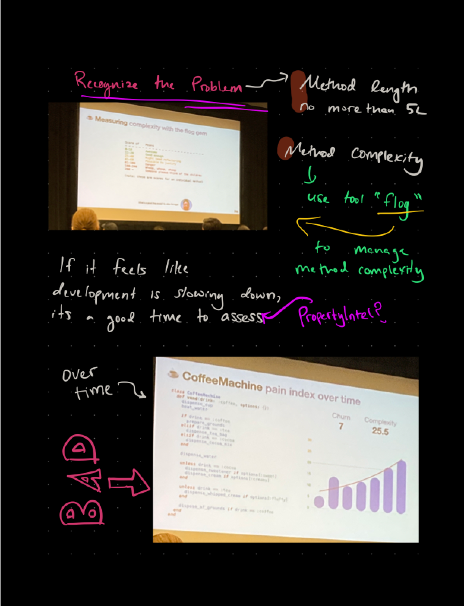

import Speaker from '@site/src/components/Speaker';

# A Brewer's Guide to Filtering out Complexity and Churn

Mechanical coffee machines are amazing! You drop in a coin, listen for the clink, make a selection, and the machine springs to life, hissing, clicking, and whirring.

<Speaker
  name='Alan Ridlehoover'
  position='Sr. Engineering Manager @ Cisco Meraki'
  imageUrl='https://sessionize.com/image/3508-400o400o2-fQtbmYjXqkj2oLqeiWLxdY.jpg'
/>
<Speaker
  name='Fit von Zastrow Alfonso'
  position='Engineering Tenchical Leader @ Cisco Meraki'
  imageUrl='https://sessionize.com/image/135d-400o400o2-nomuJyhBPGNLXZx8EsRywo.png'
/>

[Schedule Entry](https://railsconf2023.sessionize.com/session/471520)

[Slides](https://speakerdeck.com/aridlehoover/a-brewers-guide-to-filtering-out-complexity-and-churn-railsconf-2023-edition)

## Attendees
* Josh

| Relevancy    | Interesting |
| ----------- | ----------- |
| 7           | 5           |

## Notes

